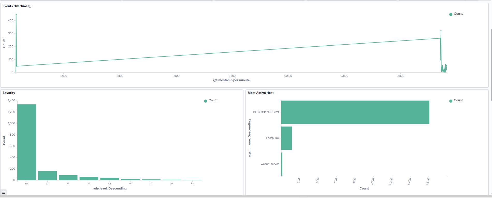
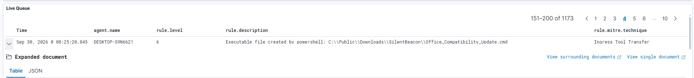
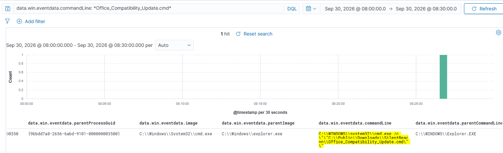

# Analysis Walkthrough
## SilentBeacon — Analyst Investigation Notes

```
Analyst   : Darren Gavriel Suntara
Date      : September 30, 2026
SIEM      : Wazuh
Host      : DESKTOP-S9N6621 (wrk-price, 10.0.1.2)
Timeframe : Sep 30, 2026 @ 08:00 — 08:30
```

> This document walks through the actual investigation steps taken to identify and reconstruct
> the SilentBeacon attack chain, based on real Wazuh telemetry from the ECorp homelab environment.
> Screenshots are taken directly from the Wazuh dashboard during live analysis.

---

## Step 1 - Triage: Identify the Anomaly Window

The investigation began with a review of the **Events Overtime** graph on the Wazuh dashboard,
covering the last 24 hours.


*Figure 1: Wazuh Events Overtime dashboard showing alert spike, severity distribution, and most active host.*

### Observations

**Alert Spike at ~08:00:**
A sharp, sudden spike in event volume was observed at approximately **08:00 local time**, in
contrast to the flat, low-level baseline from the previous 18 hours (12:00–06:00). This is the
primary trigger for investigation — normal background noise does not produce sudden vertical spikes
of this shape.

**Host Distribution:**
The "Most Active Host" chart immediately identified **DESKTOP-S9N6621** as the dominant source,
generating approximately **1,800 events** — more than three times the combined count of Ecorp-DC
and wazuh-server. This narrows the investigation focus to a single endpoint.

**Severity Distribution:**
The severity histogram shows the majority of events are **level 3** (informational/low), with a
notable cluster at **level 10** (high). The presence of high-severity events within a sudden spike
warrants immediate drill-down.

### Analyst Decision
> *"Spike at 08:00 on DESKTOP-S9N6621. High-severity events present. Narrowing timeframe to
> 08:00–09:00 for focused investigation."*

---

## Step 2 — Pivot: Identify the Initial Suspicious Alert

After narrowing the timeframe to **08:00–09:00**, the Wazuh Live Queue Table was reviewed. Scrolling
through the event list, a rule description immediately stood out from the noise.


*Figure 2: Wazuh Live Queue showing alert for executable file creation from PowerShell — Office_Compatibility_Update.cmd.*

### Alert Details

| Field | Value |
|---|---|
| **Timestamp** | Sep 30, 2026 @ 08:25:20.845 |
| **Agent** | DESKTOP-S9N6621 |
| **Rule Level** | 6 |
| **Description** | `Executable file created by powershell: C:\Public\Downloads\SilentBeacon\Office_Compatibility_Update.cmd` |
| **MITRE Technique** | Ingress Tool Transfer |

### Why This Alert Was Flagged

1. **Folder name `SilentBeacon`** — not a standard Windows or application directory. Unusual,
   non-default folder names in `C:\Public\Downloads\` are a strong indicator of attacker-created
   staging infrastructure.

2. **`Office_Compatibility_Update.cmd`** — the filename mimics a legitimate Microsoft Office
   maintenance task, but `.cmd` scripts are not a delivery mechanism for real Office updates.
   This is a textbook **masquerading** technique (MITRE T1036.005).

3. **Created by PowerShell** — a `.cmd` file being written to disk by PowerShell indicates
   **dropper behavior**: a PowerShell script writing the next stage of the attack chain to disk
   before executing it.

### Analyst Decision
> *"Suspicious dropper activity confirmed. Pivoting to the execution event for
> Office_Compatibility_Update.cmd to identify who launched it and from where."*

---

## Step 3 — Follow the Process: Parent-Child Relationship

Using Wazuh Discoveries, a targeted query was run to find the **execution event**
of `Office_Compatibility_Update.cmd` and trace its parent process:

```
data.win.eventdata.commandLine: *Office_Compatibility_Update.cmd*
```

Timeframe: `Sep 30, 2026 @ 08:00:00 → 09:00:00`


*Figure 3: DQL query result showing cmd.exe spawned by explorer.exe executing Office_Compatibility_Update.cmd.*

### Query Result (1 Hit)

| Field | Value |
|---|---|
| **Process (image)** | `C:\Windows\System32\cmd.exe` |
| **Parent Process** | `C:\Windows\explorer.exe` |
| **Command Line** | `C:\WINDOWS\system32\cmd.exe /c "C:\Public\Downloads\SilentBeacon\Office_Compatibility_Update.cmd"` |
| **Parent Command Line** | `C:\Windows\Explorer.EXE` |
| **Parent Process GUID** | `{9bbdd7a8-2656-6abd-9101-000000003500}` |

### Analysis of the Parent-Child Chain

```
C:\Windows\Explorer.EXE                              ← parent (user shell)
  └── C:\Windows\System32\cmd.exe /c                ← child
        "C:\Public\Downloads\SilentBeacon\
         Office_Compatibility_Update.cmd"
```

**`explorer.exe` as the parent is the critical finding.**

`explorer.exe` is the Windows shell — it handles the desktop and file browsing. When it spawns
a process, it almost always means a **user directly double-clicked or opened a file from the GUI**.
This is not a system process, scheduled task, or service — this is a human action.

This confirms:
- A **user on DESKTOP-S9N6621 manually executed** `Office_Compatibility_Update.cmd`
- The user was deceived into thinking this was a legitimate file
- This is the **initial access event** — the entry point of the entire attack chain (T1204.002)

The **Process GUID `{9bbdd7a8-2656-6abd-9101-000000003500}`** becomes the anchor for the next
pivot: tracing all the artifacts this process generated and child processes spawned downstream from this GUID to reconstruct the full execution chain.

### Analyst Decision
> *"User execution confirmed via explorer.exe parent. Process GUID {9bbdd7a8...} to be used
> as pivot point to trace the full downstream execution chain."*

---

## Step 4 — Reconstruct the Full Execution Chain

Using the Process GUID as an anchor and following parent-child GUID relationships through
Sysmon Event ID 1 (Process Create) records, the full execution chain was reconstructed:


This four-layer chain (.cmd → .ps1 → .cmd → .ps1) constitutes the full SilentBeacon attack,
from initial user execution to data staging and pre-exfiltration integrity verification.

---

## Investigation Summary

| Step | Action | Finding |
|---|---|---|
| 1 | Reviewed Events Overtime graph | Alert spike at 08:00 on DESKTOP-S9N6621 |
| 2 | Filtered 08:00–09:00, reviewed Live Queue | Alert: PowerShell created `SilentBeacon\Office_Compatibility_Update.cmd` |
| 3 | DQL pivot on `commandLine: *Office_Compatibility_Update.cmd*` | Confirmed `explorer.exe` parent — user execution |
| 4 | Followed Process GUID chain via processGuid | Reconstructed full 4-layer chain and 11 discovery commands |

---

## DQL Queries Used

```
# Find initial execution event
data.win.eventdata.commandLine: *Office_Compatibility_Update.cmd*

# Trace horizontally from process GUID
data.win.eventdata.processGuid: *<GUID>*

# Trace downstream processes from parent GUID
data.win.eventdata.parentProcessGuid: *<GUID>*

# Filter by agent and timeframe
agent.name: DESKTOP-S9N6621 AND @timestamp:[2026-09-30T08:00:00 TO 2026-09-30T09:00:00]
```

---
